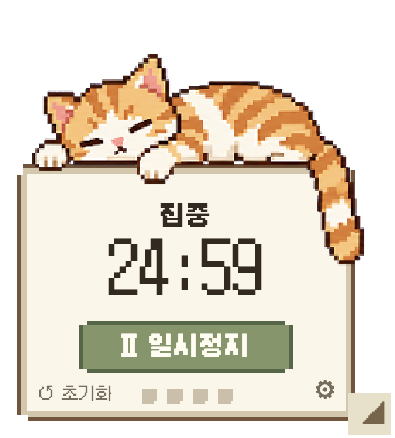

# Focus Buddy

작은 픽셀 고양이와 함께 쓰는 로컬 뽀모도로 앱입니다. macOS 메뉴바 또는 Windows 작업표시줄 알림 영역의 고양이가 기본 화면이며, 고양이 위젯·설정·기록 화면을 필요할 때 열 수 있습니다. AI 서버, 계정 로그인, 마이크·카메라가 필요하지 않습니다.

이 저장소는 기존 프로젝트에서 Focus 전용 구현을 분리한 독립 소스입니다. 자체 코드는 [MIT](LICENSE), 프로젝트가 만든 고양이 그림은 [CC BY 4.0](ARTWORK-LICENSE.md)이며, Galmuri 등 제3자 자산은 원래 라이선스를 유지합니다. 범위는 [소스·라이선스 검토](docs/SOURCE_LICENSE_REVIEW.md), [자산 출처](docs/ASSET_PROVENANCE.md), [제3자 고지](THIRD_PARTY_NOTICES.md)에 기록합니다.



## 실행

검증한 환경은 **macOS Apple Silicon(arm64)**입니다. 현재 공개 배포물은 소스이며, GitHub Release나 서명·공증된 설치 프로그램은 제공하지 않습니다. 아래 명령으로 빌드한 `release/mac-arm64/Focus Buddy Candidate.app`을 열면 메뉴바에 나타납니다. 메뉴에서 **위젯 켜기**, **설정 및 작업명**, **오늘 기록**을 선택하세요. 시작 시 창과 위젯은 기본 숨김입니다.

**Windows x64는 개발 중인 지원 경로**입니다. [Windows 개발·검증 안내](docs/WINDOWS.md)에 PowerShell 명령, 트레이 사용법, CI 검사와 실제 Windows GUI 미검증 항목을 분리해 기록합니다. Windows에서는 트레이 아이콘을 오른쪽 클릭해 메뉴를 열고, 두 번 클릭해 설정 창을 엽니다. 남은 시간은 툴팁과 메뉴 첫 줄에서 확인합니다.

앱 이름과 데이터 폴더는 기존 설치 앱과 충돌하지 않도록 `Focus Buddy Candidate`를 유지합니다. 기존 Focus Buddy의 설정·기록을 자동으로 가져오거나 변경하지 않습니다. 설치된 기존 앱을 교체하는 업데이트가 아닙니다. `package.json`의 `private: true`는 실수로 npm에 게시하는 것을 막는 설정이며 GitHub 저장소의 공개 범위를 뜻하지 않습니다.

## 개발과 빌드

Node.js 22 이상, Bun 1.4.2 이상이 필요합니다. macOS에서는 Command Line Tools(`swiftc`, `codesign`)도 필요하며 Windows 빌드는 Swift/AppKit을 사용하지 않습니다. 의존성은 잠금파일로 고정했고 검증한 Electron은 **44.5.1**입니다. 의존성·Electron 다운로드에 처음 한 번 인터넷 연결이 필요합니다.

```sh
git clone https://github.com/b1ueseoyoung/focus-buddy.git
cd focus-buddy
bun install --frozen-lockfile --ignore-scripts
node node_modules/electron/install.js
bun run build
bun run start
```

개발 서버를 사용하려면 `bun run dev`를 실행하세요. 파일·상태 IPC는 로컬 Electron preload에 연결됩니다. 브라우저만 연 모형 타이머는 포함하지 않습니다.

```sh
bun run typecheck
bun run test
bun run build
bun run test:e2e
bun run package:mac
bun run audit:bundle
bun run verify:source
```

로컬 macOS 앱을 열려면 `open "release/mac-arm64/Focus Buddy Candidate.app"`을 실행하세요.

패키지 자체의 통합 테스트:

```sh
FOCUS_BUDDY_CANDIDATE_ELECTRON="$PWD/release/mac-arm64/Focus Buddy Candidate.app/Contents/MacOS/Focus Buddy Candidate" bun run test:e2e
```

검사는 OS 임시 폴더 안의 별도 `focus-buddy-candidate-*` 프로필을 생성합니다. 시험용 샘플 기록을 실제 사용자 기록 폴더에 넣지 마세요. `FOCUS_BUDDY_USER_DATA_DIR`은 명시적인 별도 로컬 프로필이 필요할 때만 사용하세요.

## 타이머와 저장

- 기본 집중·짧은 휴식·긴 휴식은 25/5/15분입니다. 완료한 집중 4회마다 긴 휴식을 제안하며 다음 단계는 수동으로 시작합니다.
- 시작·일시정지·재개·현재 타이머 초기화·종료·휴식 건너뛰기를 지원합니다. 위젯과 메뉴·설정 창은 같은 타이머 상태를 사용합니다.
- 위젯 오른쪽 아래 모서리를 끌거나 설정/메뉴에서 80–150% 크기를 선택할 수 있습니다. 고양이·패널 밖 여백은 투명합니다.
- 소리는 기본 꺼짐입니다. 선택한 알림·코골이 소리는 로컬에서 처리합니다. 집중 5분마다 짧은 zZZ가 표시됩니다.
- 창을 숨겨도 타이머는 계속 동작합니다. 종료·절전·긴 실행 정체 시 일시정지를 저장하고 재실행하면 사용자가 재개합니다. 기록 중복을 방지합니다.

## 검증과 제한

최초 공개 버전의 검증은 [VERIFICATION.md](docs/VERIFICATION.md), Windows 변경의 검증은 [WINDOWS.md](docs/WINDOWS.md)에 기록합니다. 물리적인 창 드래그·투명 여백 클릭, 실제 절전/로그오프·강제 종료, Intel macOS와 Linux는 별도로 확인하지 않았습니다. 모의 절전·AppKit/Electron 메뉴 테스트 명령은 실제 OS 입력을 검증하지 않습니다. Windows CI는 PR의 정확한 커밋을 검사하며 실행 링크와 범위는 Windows 안내에서 확인할 수 있습니다.

macOS 빌드는 로컬 ad-hoc 서명입니다. Developer ID 서명·공증·자동 업데이트·App Store 배포를 준비한 패키지가 아닙니다. 공개 후보 소스 ZIP에는 Git 이력, `node_modules`, 개인 증거 파일과 사용자 데이터가 없으며, 바이너리는 해당 환경에서 다시 빌드합니다.

## 라이선스와 이미지 출처

Electron·React·ReactDOM·Zustand는 각 MIT 고지를 유지하며 Chromium의 동봉 고지도 보존합니다. 폰트는 Galmuri의 SIL OFL 1.1입니다. 사용한 sprite-gen 후처리 도구의 Apache-2.0 LICENSE/NOTICE는 생성 이미지의 라이선스로 적용하지 않습니다. [THIRD_PARTY_NOTICES.md](THIRD_PARTY_NOTICES.md)를 참고하세요.

프로젝트 소스·스크립트·재생 JSON은 [MIT](LICENSE)입니다. 고양이 PNG/ICNS와 직접 제작 메뉴·트레이 그림은 [CC BY 4.0](ARTWORK-LICENSE.md)입니다. 이미지를 공유할 때 `Focus Buddy cat artwork, published by b1ueseoyoung`과 저장소·라이선스 링크를 남기고 수정한 내용을 표시하세요. [공식 MIT](https://opensource.org/license/mit), [공식 CC BY 4.0](https://creativecommons.org/licenses/by/4.0/legalcode.en) 원문을 기준으로 전문을 보존했습니다.

위젯 고양이와 앱 아이콘은 Codex 내장 ImageGen의 AI 생성 그림입니다. sprite-gen은 추출·후처리에 사용했으며 제공자 `gen-set` 시도는 0개 성공이었습니다. 직접 그린 메뉴 얼굴과 구분해 [출처 문서](docs/ASSET_PROVENANCE.md)에 기록합니다. AI 생성물의 독점권·저작권 보호·유일성·비침해를 보증하지 않으며, 라이선스는 권리자가 실제 부여할 수 있는 권리 범위에 적용됩니다. 제3자 자산을 MIT나 CC BY 4.0으로 재허가하지 않습니다.
